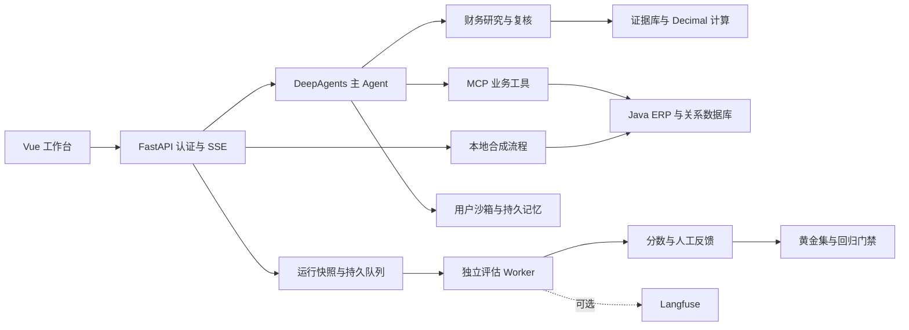

# ERP_OPENCLAW

**基于Harness架构多智能体企业采购助手**

工程名沿用多个同源公开实现及早期工程配置中的 `ERP_OPENCLAW`，中文名称对应[码士课程标题](https://www.mashibing.com/course/2959)。本次未查到官方公开仓库地址；英文名是根据公开工程线索作出的判断，详见[命名依据](SOURCES.md#项目命名依据)。

**可回查证据、可审批执行、可持续评估的多 Agent 实战项目。**

[](https://github.com/ooo1208/ERP_OPENCLAW/actions/workflows/quality.yml)

将采购 ERP、DeepAgents、MCP、用户沙箱、财务证据和异步评估接成一个可操作的工作台。包含无需模型密钥的本地演示，也提供接入真实模型的 live 运行方式。

> 本项目根据公开课程线索和多个公开仓库对比后，按 **14 章推测还原并补充**。不是官方源码，也不冒称官方原始章节。每章独立提交并推送，使用实际时间。复用部分保留原作者 MIT 许可；所有演示财务与采购数据均为合成数据。

[章节与实验](docs/CHAPTERS.md) · [来源和许可](SOURCES.md) · [缺口对比矩阵](docs/COMPARISON.md) · [验收记录](docs/VERIFICATION.md) · [详细启动说明](docs/运行与部署.md)

配套学习工程已独立整理：[Agent-Learning 总入口](https://github.com/ooo1208/Agent-Learning) · [基础项目与本工程的对应关系](docs/LEARNING_PROJECTS.md)。

## 能实际演示什么

| 场景 | 实现与证据 |
|---|---|
| 导入财报，找出数字出处 | TXT/MD/CSV/PDF 提取，FTS5 检索，行号/页码和引用回查，用户与资料分组隔离 |
| 计算并复核财务指标 | Decimal 精确计算、公式与输入保留、FinQA 外部数据适配，研究/复核两个受限子 Agent |
| 采购审批与业务执行 | Java 21 / Spring Boot，8 张关系表、54 条 REST 路由、8 个 MCP 工具，订单部分更新、库存竞争保护、持久化幂等 |
| 管理长任务 | 近期对话摘要、结构化约束、持久里程碑、每次模型调用的阶段提示、本地版本化 Prompt |
| 处理用户隔离与沙箱恢复 | 可信 user/thread 绑定，MongoDB checkpoint/Store，Skills 持久恢复，稳定沙箱代理与结果未知分类 |
| 让评估独立于主响应 | SSE 单次旁路采集，持久 Worker、租约、Outbox、重试、人工反馈与版本化黄金集 |
| 在发布前发现回退 | 12 条合成黄金例、确定性评分、正负门禁、Python/Java/前端 CI；可选 Langfuse OTLP 与分数投递 |



## 本地启动

推荐 Python 3.11、Node.js 22.12+、Java 21、Maven 3.9、uv 0.11.2。

```powershell
git clone https://github.com/ooo1208/ERP_OPENCLAW.git
cd ERP_OPENCLAW
uv sync --locked --index-url https://pypi.org/simple
npm --prefix frontend ci
mvn -f erp-service/pom.xml package
uv run --frozen python start_all.py --erp --quotes
```

打开 **http://127.0.0.1:5173**，创建本地账号。先在「证据工作台」填入并导入合成财报，搜索“营业收入”；在「评估中心」提交样例、查看 Worker 评分和人工回流；聊天输入“演示下单 2 件”，审批后写入本地 ERP。

此默认模式不调用模型。数据位于 `.local/asu`，ERP 数据位于 `erp-service/data`，均被 Git 忽略。Ctrl+C 停止启动器管理的进程。已有服务占用端口时会报错，不会替你关闭其他进程。

live 模式需要填写 `.env`，另行准备 MongoDB 与 OpenSandbox，再执行：

```powershell
uv run --frozen python start_all.py --mode live --erp --quotes
```

启动器同时管理 MCP、异步 Agent Protocol、Web、评估 Worker 与前端。容器内的报价地址需要按 [报价 Skill 说明](src/skills/procurement/supplier-price-urls/SKILL.md) 配置。可选 Docker 演示见 [部署说明](docs/运行与部署.md)。

## 验证

```powershell
uv run --frozen pytest -q
mvn -f erp-service/pom.xml test
npm --prefix frontend run build
npm --prefix frontend audit --audit-level=high
uv run --frozen python -m asu_eval.gate --dataset evals/golden.synthetic.json --predictions evals/predictions.baseline.json --baseline evals/baseline.synthetic.json
```

本地验收：**105 项 Python 测试通过**；11 项需显式开关的跨进程测试跳过，13 项外部服务/模型测试默认不选。另行开启专用 Java/MCP 测试通过；Java 12 项集成测试通过；前端构建成功、依赖 audit 为 0。浏览器已验收文档入库、检索、引用回查、计算、评估、反馈回流与 ERP 审批。完整命令和范围见 [验收记录](docs/VERIFICATION.md)。

## 实现边界

这是可复现的工程实战项目。FTS5 当前是词法检索；不包含 OCR、向量召回、真实征信接入或银行授信审批系统。财务角色具有工具权限限制，但研究后复核的顺序仍由 Prompt 指导。

合成黄金例验证的是评分与门禁实现，**不代表模型准确率或真实业务提升**。真实 LLM、Langfuse 云端投递、Docker/OpenSandbox 与 MySQL 尚未在本次环境完成端到端验收；OTLP 目前记录完成快照，未实现完整逐 token Trace。SQLite 队列与 ERP 全局写锁适用于本地和小规模验证，生产扩展项见 [对比矩阵](docs/COMPARISON.md)。

基础 Agent/MCP/前端代码来自 [KagaribiDev/procurepilot](https://github.com/KagaribiDev/procurepilot)，固定上游版本和其他参考列于 [SOURCES.md](SOURCES.md)。新增 ERP、财务证据、可靠评估与集成修复在相应章节说明。
