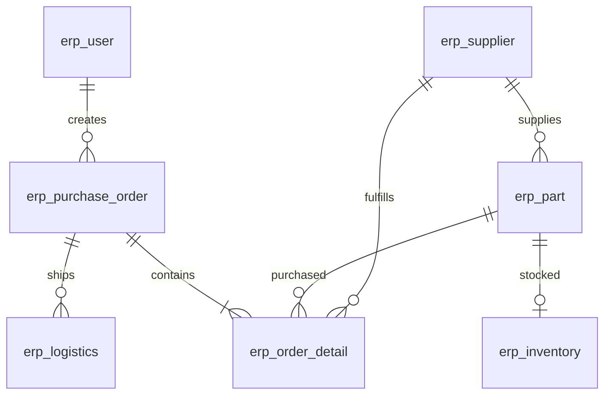

# ASu Java ERP 服务

这是面向采购 Agent 工具调用的独立 Java 实现。公开采购项目用于核对接口路径和业务行为；本目录没有复制无明确许可证的 Java ERP 或 ProcureFlow 实现。所有示例企业、联系人、订单和报价都是合成数据。

## 启动与验证

需要 JDK 17+（本次使用 JDK 21 验证）和 Maven 3.9+。

```bash
cd erp-service
mvn test
mvn spring-boot:run
```

默认服务地址为 `http://127.0.0.1:8080/api`。健康检查是 `http://127.0.0.1:8080/actuator/health`。默认 H2 数据库写入 `data/erp.mv.db`，重启保留数据。首次空库自动加入演示种子；已存在供应商或零件时不会再次导入。无需模型 API、Docker 或外部数据库即可运行 ERP。

打包后运行：

```bash
mvn package
java -jar target/erp-service-1.0.0.jar
```

PowerShell 如未把 Maven 加入 PATH，可使用本机 Maven 的绝对路径调用，项目不依赖某台机器的固定路径。

## MySQL 配置

先创建专用的 MySQL 8.0.16+ 数据库和账号，再设置环境变量。`mysql` profile 默认不导入合成数据。

```powershell
$env:SPRING_PROFILES_ACTIVE = 'mysql'
$env:ERP_DB_URL = 'jdbc:mysql://127.0.0.1:3306/asu_erp?useUnicode=true&characterEncoding=utf8&serverTimezone=UTC'
$env:ERP_DB_USER = 'asu_erp'
$env:ERP_DB_PASSWORD = '<从本机安全配置提供>'
$env:ERP_API_KEY = '<自行生成的服务密钥>'
mvn spring-boot:run
```

| 环境变量 | 用途 | 默认值 |
|---|---|---|
| `ERP_PORT` | HTTP 端口 | `8080` |
| `ERP_BIND_ADDRESS` | 监听地址 | `127.0.0.1` |
| `ERP_SEED_ENABLED` | 空库导入合成示例 | H2 为 `true`，MySQL 为 `false` |
| `ERP_API_KEY` | 设置后所有 `/api/**` 必须携带 `X-API-Key` | 本地默认关闭 |
| `ERP_DB_URL / ERP_DB_USER / ERP_DB_PASSWORD` | MySQL 连接 | 见配置文件；密码必须提供 |

为容器设置 `ERP_BIND_ADDRESS=0.0.0.0`，并通过服务端环境配置密钥。业务用户表用于订单创建人关联；本服务的 API Key 是服务身份验证，不是完整的人员登录和角色权限系统。

## 关系模型

八张业务表分别为 `erp_user`、`erp_supplier`、`erp_part`、`erp_purchase_order`、`erp_order_detail`、`erp_inventory`、`erp_customer`、`erp_logistics`。另有事务锁、序列、幂等记录三张技术表。



- 金额独立存入 `DECIMAL(18,2)` 列，Java 使用 `BigDecimal`；不接受需要隐式四舍五入的单价、小计或金额。小计必须等于单价乘数量，订单总额由明细汇总并校验。
- 主外键、业务编号唯一约束、库存非负和明细金额 `CHECK` 都在数据库执行。`extra_json` 只保留扩展字段，核心关系和金额不依赖 JSON 存储。
- 写操作在单个数据库事务中执行，使用数据库行锁串行保护变更。幂等响应和业务写入同时提交；失败整体回滚。
- 持久序列避免删除后重用 ID。删除订单级联删除明细；被订单、库存或物流引用的其他对象禁止删除。
- 订单头的部分更新保留原明细、编号和时间；未改变明细时不删除再插入。显式提供新明细才替换，空数组和 `null` 被拒绝。
- 出库先校验可用库存，再更新；并发竞争不能超扣。库存关联零件名称等条件在分页前应用，`total` 为筛选后的总量。

## 接口覆盖

统一响应形状：`{"code":200,"message":"success","data":...,"timestamp":...}`。业务错误使用对应 HTTP 400/404/409，密钥错误使用 401。字段使用 camelCase。

| 业务模块 | 路由数量 | 功能 |
|---|---:|---|
| suppliers | 8 | 增删改查、分页/名称搜索、状态、信用等级 |
| parts | 8 | 增删改查、分页/搜索、单价、按供应商查询 |
| orders | 9 | 创建、部分更新、删除、订单/明细查询、分页、状态、统计、按零件和日期检索明细 |
| inventory | 7 | 库存明细/分页、入库/出库、预警、安全库存、库存检查 |
| customers | 8 | 增删改查、分页/搜索、客户类型、折扣 |
| logistics | 9 | 增删改查、分页/按订单查询、状态、发货和收货 |
| statistics | 5 | 仪表盘、供应商、零件、库存、月度采购趋势 |

全部 54 条路径见 [endpoint-manifest.json](src/test/resources/endpoint-manifest.json)。PATCH 和库存写接口支持 JSON body 或 query 参数，body 同名字段优先。分页参数为 `current`（从 1 开始）和 `size`（1～200）。

原采购 Agent 的八个 MCP 工具接入如下：

| MCP 工具 | HTTP 接口 |
|---|---|
| `supplier_query` | `GET /api/suppliers/search?name=...` |
| `part_query` | `GET /api/parts/page?current=1&size=10&name=...&category=...&supplierId=...` |
| `part_search` | `GET /api/parts/search?name=...` |
| `part_by_supplier` | `GET /api/parts/supplier/{supplierId}` |
| `order_create` | `POST /api/orders/create` |
| `order_update` | `PUT /api/orders/update/{id}` |
| `order_search_details` | `GET /api/orders/search-details?partName=...&startDate=2026-01-01&endDate=2026-12-31` |
| `inventory_warning` | `GET /api/inventory/warning` |

创建订单示例：

```json
{
  "orderNumber": "DEMO-CLIENT-ORDER-001",
  "createdBy": 1,
  "remark": "合成采购需求",
  "orderDetail": [
    {"partId": 1, "quantity": 10, "unitPrice": "38.50"}
  ]
}
```

订单状态为 `1 待审核 → 2 已审核 → 3 采购中 → 4 已入库`，1～3 可以转为 `5 已取消`；终态不能回退。新订单从 1 开始。这里的状态变更接口供经过授权的应用调用，Agent 的人工审批应在工具执行前完成。

只改订单备注时发送 `{"remark":"新备注"}`。不要在更新客户端自动生成新的 `orderNumber` 或 `orderTime`。

### 幂等写入

所有 POST、PUT、PATCH、DELETE 写操作可提供 `Idempotency-Key`（1～128 字符）。相同键、相同操作及规范化后的请求体返回首次结果；相同键用于不同请求返回 409。请求的对象字段顺序不影响指纹。

键是当前 ERP 数据库内的服务级命名空间，客户端应使用 UUID，或包含租户/用户/业务操作的唯一标识。记录与业务写入同事务提交并持久化，重启不丢失；当前没有自动清理，需按业务重试窗口设计保留策略后再用于长期部署。

## 合成种子

| 零件 ID | 零件名称 | 单价 | 供应商 ID | 当前库存 / 安全库存 |
|---:|---|---:|---:|---:|
| 1 | 陶瓷刹车片 | 38.50 | 1 | 8 / 20 |
| 2 | 铝合金制动盘 | 126.80 | 1 | 36 / 15 |
| 3 | 强化传动链条 | 89.90 | 3 | 4 / 10 |

同时包含三家演示供应商、一名演示创建人、一家演示客户、一张历史订单和一条物流记录。历史订单为 2026-01-15，下单总额 834.50；查询预警应得到零件 1 和 3。所有邮件域名使用 `example.invalid`。

## 验证范围与边界

`mvn test` 使用 H2 内存数据库完成行为集成测试，包括订单部分更新/替换、精确金额、失败回滚、4 线程幂等重试、库存竞争/过滤分页、外键与 CHECK、状态转换、其余业务 CRUD、API Key 和 54 路由注册。路由注册验证不等于每条路径的所有参数组合都已覆盖。

MySQL profile、DDL 和 JDBC 映射已经提供；若未配置真实 MySQL，H2 测试不能替代 MySQL 集成验收。当前查询为关系表读取后在业务层筛选和分页，写锁为全局串行，适合教学和小规模本地演示；大数据量应改成 SQL 条件分页、批量关联加载，并按库存/订单拆分锁范围。未实现多仓批次、财务结算、税费、真实物流、用户登录/RBAC或旧项目数据库迁移。

协议参考：[procurepilot MCP 工具](https://github.com/KagaribiDev/procurepilot/tree/main/src/mcp_server/tools)、[公开 54 路由契约](https://github.com/Running-hue/procureflow-agent/blob/main/tests/contract/java_endpoint_manifest.json)。这些链接用于说明兼容目标，不表示本服务属于官方配套源码。
